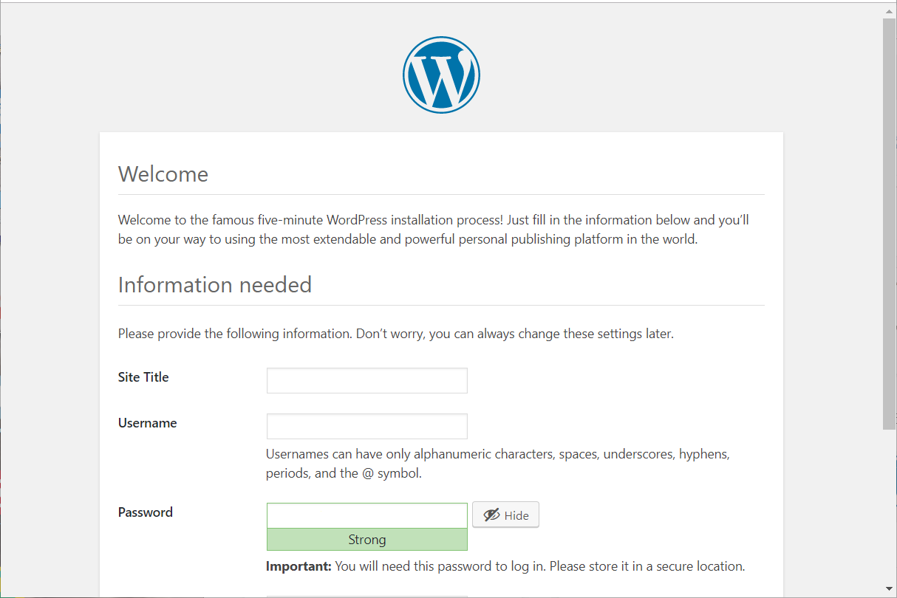
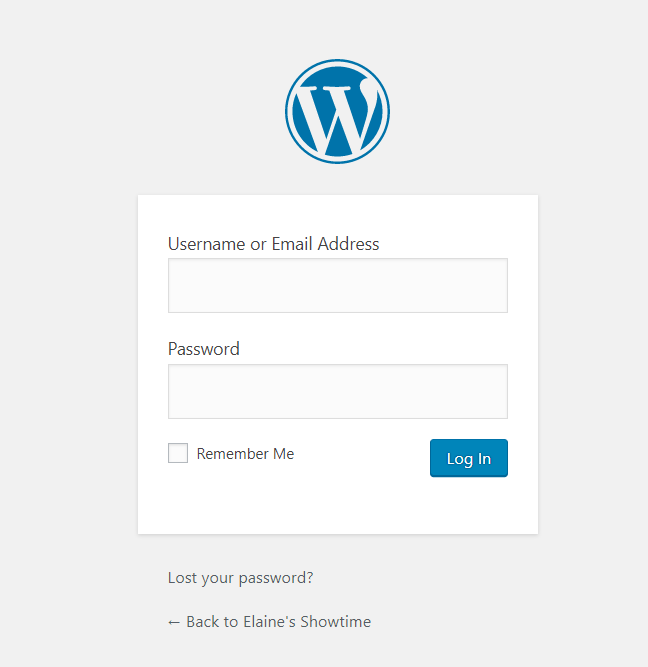

本文演示基于腾讯云CVM(Cloud Virtual Machine)CentOS 7.6的WordPress搭建。
centos下Wordpress个人网站的搭建超简单教程！！！

# 前提

购买腾讯云服务器实例（独立的域名并实名认证），参考[如何购买腾讯云服务器](https://cloud.tencent.com/developer/article/1470211)

# 部署环境：LAMP

+ 云操作系统：CentOS 7.2 64位；
+ HTTP服务器：Apache Web 服务器；
+ 数据库：MySQL；
+ 建站工具：WordPress（基于PHP）。

# 步骤

## 1.安装Apache Web服务器

使用yum工具安装：
> sudo yum install httpd

输入y，安装完成显示如下

启动apache http server
> 启动apache服务器  systemctl start httpd

> 设置开机自动启动  systemctl enable httpd

> 关闭apache服务器  systemctl stop httpd

测试Apache服务器是否成功运行，找到腾讯云实例的公有IP地址(your_cvm_ip)，在你本地主机的浏览器上输入：

> http://your_cvm_ip/

若运行正常，将出现如下界面：

## 2.安装MySQL

CentOS 7.2的yum源中并末包含MySQL，需要其他方式手动安装。因此，我们采用MySQL数据库的开源分支MariaDB作为替代。 安装MariaDB：

>sudo yum install mariadb-server mariadb

安装好之后，启动mariadb：

>sudo systemctl start mariadb

随后，运行简单的安全脚本以移除潜在的安全风险，启动交互脚本：

>sudo mysql_secure_installation

设置相应的root访问密码以及相关的设置(都选择Y)。
最后设置开机启动MariaDB：

>sudo systemctl enable mariadb.service

## 3.安装PHP

PHP是一种网页开发语言，能够运行脚本，连接MySQL数据库，并显示动态网页内容。
默认的PHP版本太低（PHP 5.4.16），无法支持最新的WordPress（笔者写作时为5.2.2），因此需要手动安装PHP较新的版本(PHP 7.2)。
PHP 7.x包在许多仓库中都包含，这里我们使用Remi仓库，而Remi仓库依赖于EPEL仓库，因此首先启用这两个仓库
>sudo yum install epel-release yum-utils
>sudo yum install http://rpms.remirepo.net/enterprise/remi-release-7.rpm

接着启用PHP 7.2 Remi仓库：
>sudo yum-config-manager --enable remi-php72

安装PHP以及php-mysql
>sudo yum install php php-mysql

查看安装的php版本：
>php -v

安装之后，重启Apache服务器以支持PHP：
>sudo systemctl restart httpd.service

## 安装PHP模块

为了更好的运行PHP，需要启动PHP附加模块，使用如下命令可以查看可用模块：

>yum install php-fpm php-gd

部分结果如图所示：

这里先行安装php-fpm(PHP FastCGI Process Manager)和php-gd(A module for PHP applications for using the gd graphics library)，WordPress使用php-gd进行图片的缩放。

重启Apache服务：
>sudo service httpd restart

至此，LAMP环境已经安装成功，接下来测试PHP。

## 4.测试PHP

这里我们利用一个简单的信息显示页面（info.php）测试PHP。创建info.php并将其置于Web服务的根目录（/var/www/html/）：

>sudo vim /var/www/html/info.php

该命令使用vim在/var/www/html/处创建一个空白文件info.php，我们添加如下内容：

>\<?php phpinfo(); ?>

完成之后，使用刚才获取的cvm的IP地址，在你的本地主机的浏览器中输入:

>http://your_cvm_ip/info.php

即可看到如下界面：

## 5.安装WordPress以及完成相关配置

### (1)为WordPress创建一个MySQL数据库

首先以root用户登录MySQL数据库：

>mysql -u root -p

键入之前设置的root用户密码，并按下回车键进入MySQL命令行模式。

首先为WordPress创建一个新的数据库：

>CREATE DATABASE wordpress;

注意：MySQL的语句都以分号结尾。
接着为WordPress创建一个独立的MySQL用户：

>CREATE USER wordpressuser@localhost IDENTIFIED BY '123456';

“wordpressuser”和“123456”使用你自定义的用户名和密码。授权给wordpressuser用户访问数据库的权限：

>GRANT ALL PRIVILEGES ON wordpress.* TO wordpressuser@localhost IDENTIFIED BY 'password';

随后刷新MySQL的权限：

>FLUSH PRIVILEGES;

最后，退出MySQL的命令行模式：

>exit

(2)安装WordPress
下载WordPress至当前用户的主目录：

>wget http://wordpress.org/latest.tar.gz

最近被防火墙了，我想到官网都下不了(给大家一个github下载地址)

> https://raw.githubusercontent.com/helang0616/gitalk/master/wordpress-5.2.4.tar.gz

wget命令从WordPress官方网站下载最新的WordPress集成压缩包，解压该文件：

>tar xzvf latest.tar.gz

解压之后在主目录下产生一个wordpress文件夹。我们将该文件夹下的内容同步到Apache服务器的根目录下，使得wordpress的内容能够被访问。这里使用rsync命令：

>sudo rsync -avP ~/wordpress/ /var/www/html/

接着在Apache服务器目录下为wordpress创建一个文件夹来保存上传的文件：

>mkdir /var/www/html/wp-content/uploads

对Apache服务器的目录以及wordpress相关文件夹设置访问权限：

>sudo chown -R apache:apache /var/www/html/*

这样Apache Web服务器能够创建、更改WordPress相关文件，同时我们也能够上传文件

(3)配置WordPress
大多数的WordPress配置可以通过其Web页面完成，但首先通过命令行连接WordPress和MySQL。
定位到wordpress所在文件夹：

>cd /var/www/html

WordPress的配置依赖于wp-config.php文件，当前该文件夹下并没有该文件，我们通过拷贝wp-config-sample.php文件来生成：
>cp wp-config-sample.php wp-config.php

然后，通过nano超简单文本编辑器来修改配置(nano使用说明请参考[nano命令使用大全](https://ipcmen.com/nano)),主要是MySQL相关配置：
>nano wp-config.php

修改下面四个值

>define( 'DB_NAME', 'wordpress' );

>define( 'DB_USER', 'wordpressuser' );

>define( 'DB_PASSWORD', '123456' );

>define( 'DB_HOST', 'localhost' );

将文件中的DB_NAME，DB_USER和DB_PASSWORD更改成之前为WordPress创建的数据库的相关信息，这三处信息是当前唯一需要修改的。

退出:按Ctrl+X  输入Y保存，按回车

(4)通过Web界面进一步配置WordPress
经过上退出
WordPress运行的相关组件已经就绪，接下来通过WordPress提供的Web页面进一步配置。输入你的IP地址或者域名：

>http://server_domain_name_or_IP

出现如下界面：

设置网站的标题，用户名和密码以及电子邮件等，点击Install WordPress，弹出确认页面：

点击Log In，弹出登录界面：

输入用户名和密码之后，进入WordPress的控制面板：

## 域名

基于IP的访问方式显然不太友好，为了快捷访问可以添加域名，具体的注册以及解析方式可参考：[腾讯云Linux服务器搭建一个WordPress博客](https://cloud.tencent.com/developer/article/1436859)

参考文献

>[How To Install Linux, Apache, MySQL, PHP (LAMP)stack On CentOS 7](https://www.digitalocean.com/community/tutorials/how-to-install-linux-apache-mysql-php-lamp-stack-on-centos-7)

>[How To Install WordPress on CentOS 7](https://www.digitalocean.com/community/tutorials/how-to-install-wordpress-on-centos-7)

>[Install PHP 7 on CentOS 7](https://linuxize.com/post/install-php-7-on-centos-7/#enabling-remi-repository)
