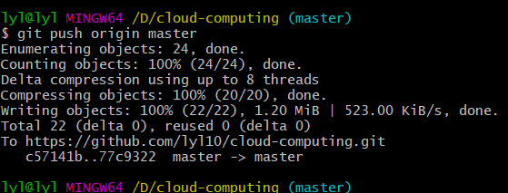

# GitHub简介

GitHub是一个面向开源及私有软件项目的托管平台，因为只使用git 作为唯一的版本库格式进行托管，故名GitHub。

GitHub于2008年4月10日正式上线，除了Git代码仓库托管及基本的 Web管理界面以外，还提供了订阅、讨论组、文本渲染、在线文件编辑器、协作图谱（报表）、代码片段分享（Gist）等功能。目前，其注册用户已经超过350万，托管版本数量也是非常之多，其中不乏知名开源项目 Ruby on Rails、jQuery、python 等。

## GitHub新手使用手册

## 1.GitHub注册并创建库

+ 进入官网进行注册  [GitHub官网](https://github.com/)

英语不好的同学建议使用Google浏览器，可以快速翻译网页,超方便！

通过简单的基本资料填写，你就会有一个属于自己的GitHub账号，
再简单注册完成之后会需要验证你所输入的邮箱才能正常使用你的GitHub。
 在注册完成之后，完成一些简单的设置之后，你需要创建一个属于自己的库

+ 在登陆自己的GitHub账号之后，在网页右上角的小加号是用来创建自己的库的按钮，之后的步骤将网页翻译成中文之后，按提示进行创建自己的库即可。

第一个框是自己为自己的库起一个名字，第二个框是自己对库的一个简单介绍

  在创建完成自己的库之后，下面就要让自己的电脑克隆一个自己所创建的库，方面自己电脑上的代码同步到GitHub你所创建的库当中。
  为了实现，就需要安装一个软件，Git。

## 2.安装Git 配置ssh

+ [git-scm.com](https://git-scm.com/)  首先进入GitHub官网，下载适合自己电脑的版本

+ 下载完安装包之后运行
在安装过程中直接默认选项即可。

    

+ 安装好之后，双击打开Git Bash,就是这样的一个黑框界面：

+ 首先要在本地创建一个ssh key 
   这个的目的就是你现在需要在你电脑上获得一个密匙，就是咱们平时的验证码一样的东西，获取之后，在你的GitHub账号里边输入之后，你的电脑就和你的GitHub账号联系在一起了，这样以后就可以十分方便的通过Git bash 随时上传你的代码。下边介绍一下如果获得这个钥匙，又是如何输入到你的GitHub里边的呢。
+ 检测是否存在ssh keys

>ls -al ~/.ssh

我之前创过了所以是这样的

+ 接下来就要开始创建属于你自己的秘钥
   要在黑框里输入命令：(引号内需要改成你在注册GitHub的时候绑定的邮箱账号)
>$ ssh -keygen -t rsa  -C  "your email@.com"

一路回车，出现如下界面：(网图我自己之前忘记截图了)

默认情况下生成的ssh key放置于“C:\Users\UserName”下的.ssh文件夹中，该命令列出该文件夹下包含的文件。

这里注意，建议不输入任何文件名，直接回车，这样就使用系统默认的设置。那么在“C:\Users\UserName”文件夹下就会创建.ssh文件夹，文件夹中生成“id_rsa”和“id_rsa.pub”两个文件，分别对应私钥和公钥。

+ 说明你的密匙已经成功创建了，现在打开上述的存储.ssh文件的位置，打开id_rsa.pub文件，复制里面的内容（秘钥）：
登录你的GitHub账号，找到Settings–>SSH and GPG keys中

+ 在网页右上角点击new  SSH Key按钮创建秘钥，title是你给你的秘钥起一个标题，key里面就把你刚才复制的秘钥粘贴进去，点击add SSH KEY就可以了：
之后再回到Git Bash, 测试SSH Key是否配置成功：
>ssh -T git@github.com

再输入yes, 出现如下界面，就说明链接成功了

##3.配置GitHub的用户名和邮箱
（name最好和GitHub上边的一样，email是一定要是注册GitHub的那个邮箱地址）
>git config --global user.name “your name”

"your name"替换成你的GitHub用户名。
>git config --global user.email “email@example.com”

这里"email@example.com"替换成你的GitHub邮箱
##4.创建GitHub项目并在本地进行同步
下面就要将你在github上创建的仓库克隆到你的本地来，方便以后进行代码上传。

打开你所创建的仓库，拷贝GitHub网站中的项目网址

+ 创建本地代码仓库
首先在本地规划好一处文件夹用于同步GitHub的项目，然后打开Git Bash，定位到此次你想要同步的GitHub项目的文件夹，使用“cd”命令。

接下来将在此文件夹添加刚才创建的GitHub的项目

+ 初始化本地文件夹作为一个Git仓库

>git init

+ 添加远程代码仓库的URL(刚才拷贝的GitHub网站中的项目网址)

>git remote add origin remote_repository_URL

remote_repository_URL替换为刚才拷贝的项目的URL。说明，origin指代远程代码仓库（GitHub中），master表示本地的主分支。验证一下添加是否成功：
>git remote -v

+ 首先从远程代码仓库拉取数据

>git pull origin master

+ 新建README文档，README文档是每个GitHub项目必备，说明项目内容。上文没有创建，在此处完成。

>touch README.md

+ 添加文件夹中的所有文件：

>git add .

+ 提交文件：

>git commit -m “First commit”

注意commit只在本地提交，并未同步到远程服务器。

+ 推送本地更新至远程服务器：

>git push -u origin master

注意：这里必须首先从GitHub拉取数据，很多教程上忽略这个步骤。这样容易导致出现本地版本和远程版本冲突的困境。

### git 一次性 add多个文件或提交多次修改

>git  add --all

>git commit -m 'add more files'

>git push origin master

然后在输入git push origin master 之后会出现一个弹窗：

出现上面界面，表示已经成功了。现在打开你的Github网站，找到你所创建的库，

你所创建的文件已经上传上去了。
再之后，你只需要将你的代码，放到库的对应的文件夹中，然后使用
>git add 

>git commit -m 

最后

>git push origin master

将你的代码提交就可以了。
