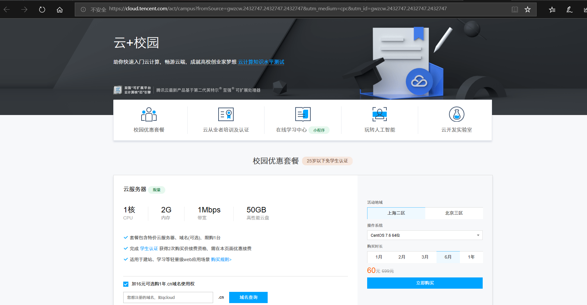
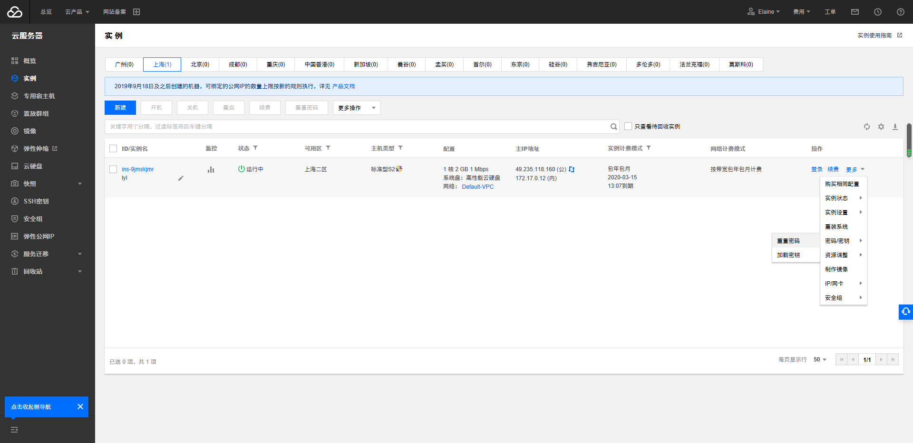
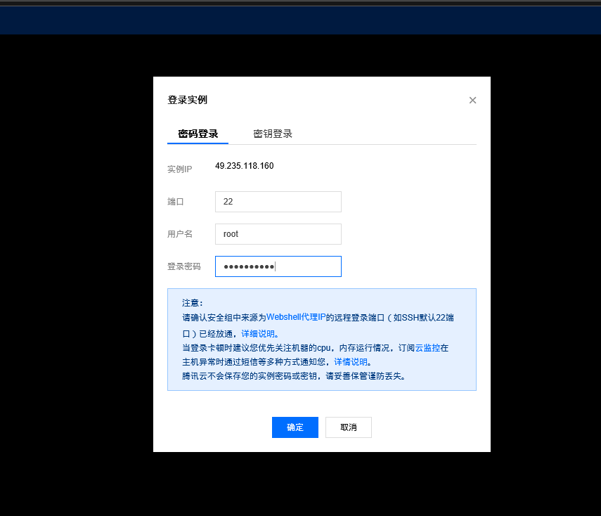
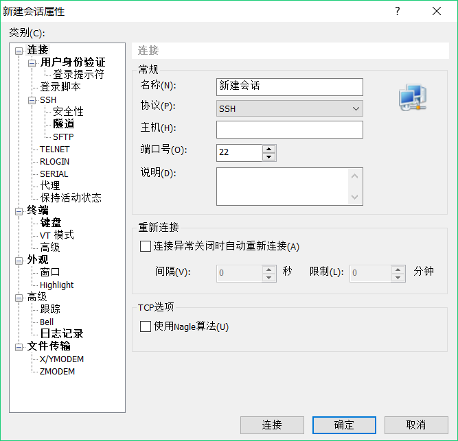

#购买腾讯云服务器并登录
1.购买[腾讯云服务器 学生套餐](https://cloud.tencent.com/act/campus?fromSource=gwzcw.2432747.2432747.2432747&utm_medium=cpc&utm_id=gwzcw.2432747.2432747.2432747)

选择如图所示 操作系统：CentOS 7.2 64位，也可加购域名

点击购买，微信扫码登录，填写基本账号信息，注册购买成功

2.使用Web Shell登录已购买的云服务器实例

用浏览器打开腾讯云，点击登录，微信扫码授权
打开左上角云产品-->>云服务器

重置云服务器密码（原始密码十分复杂）

输入新的密码

点击登录实例

使用Web Shell登录成功

3.下载安装Xshell（包含在Xmanager中），并使用Xshell登录腾讯云实例

[Xshell官网](http://www.xshellcn.com/)下载Xshell6

安装Xshell
   Xshell的安装特别简单，没有特别需要注意的，基本上就是单击“下一步”按钮。

   通过Xshell连接腾讯云服务器

打开Xshell

弹出“新建会话熟悉”对话框，如下图所示，输入名称（一般为主机名）和主机对应的IP地址，单击“确定”按钮。

主机IP在腾讯云上这里有显示 填写(公）

  在用户身份验证上按如下填写：
  用户：root
  密码：刚刚你重置的腾讯云实例的密码

  点击连接
  连接成功

# 本地安装VMware Workstation和CentOS操作系统

1.自行下载安装VMware WorkStation

  任何版本都行，视自己机器的配置而定，比如VMware  WorkStation9，12，或者15都可，版本越高要求的机器配置越高。

   我安装的是VMware Workstation Player 15 比VMware Workstation 15更小更轻量级，学生党推荐！

 [VMware Workstation Player](https://www.vmware.com/cn/products/workstation-player/workstation-player-evaluation.html)是在 Windows 或 Linux PC 上运行单一虚拟机的理想实用程序。各类组织利用 Workstation Player 交付代管企业桌面，而学生和教育工作者则用它来进行学习和培训。

2.下载[CentOS7.6](http://mirrors.aliyun.com/centos/7.6.1810/isos/x86_64/CentOS-7-x86_64-DVD-1810.iso)

3.在VMware WorkStation安装CentOS操作系统
  安装推荐[教程](https://www.runoob.com/w3cnote/vmware-install-centos7.html)
