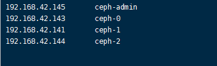
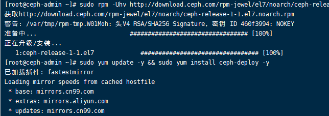

# Ceph的安装与实践

***

## 步骤1 安装配置虚拟机

1.下载最小化安装镜像

[镜像下载链接](https://mirrors.tuna.tsinghua.edu.cn/centos/7.7.1908/isos/x86_64/CentOS-7-x86_64-Minimal-1908.iso)

centos7 Minimal 虚拟机安装[图文教程](https://blog.csdn.net/Fly_Du_/article/details/88734553)

2.进入系统后，想要粘贴代码很不方便，用ssh软件连接VMware虚拟机

   先查询ip：ip addr

3.在shell软件上新建连接

4.连接成功

## 步骤2-配置所有节点

### 创建一个Ceph用户

1.在所有节点上创建一个名为“ **cephuser** ” 的新用户。

>*useradd -d /home/cephuser -m cephuser*  
>*passwd cephuser*

2.创建新用户后，我们需要为“cephuser”配置sudo。他必须能够以root用户身份运行命令，并且无需密码即可获得root用户特权。

运行以下命令为用户创建一个sudoers文件，并使用sed编辑/ etc / sudoers文件。

>*echo "cephuser ALL = (root) NOPASSWD:ALL" \| sudo tee /etc/sudoers.d/cephuser*  

>*chmod 0440 /etc/sudoers.d/cephuser*  

>*sed -i s'/Defaults requiretty/\#Defaults requiretty'/g /etc/sudoers*

### 安装和配置NTP

1.安装NTP以同步所有节点上的日期和时间。运行ntpdate命令通过NTP协议设置日期和时间，我们将使用us
pool NTP服务器。然后启动并启用NTP服务器在引导时运行。

>*yum install -y ntp ntpdate ntp-doc*  

>*ntpdate 0.us.pool.ntp.org*  

>*hwclock --systohc*  

>*systemctl enable ntpd.service*  

>*systemctl start ntpd.service*

### 安装Open-vm-tools

如果要在VMware内部运行所有节点，则需要安装此虚拟化实用程序。否则，请跳过此步骤。

>*yum install -y open-vm-tools*

### 禁用SELinux

通过使用sed流编辑器编辑SELinux配置文件，在所有节点上禁用SELinux。

*sed -i 's/SELINUX=enforcing/SELINUX=disabled/g' /etc/selinux/config*

*yum -y install vim*

### 配置主机文件

使用vim编辑器在所有节点上编辑/ etc /
hosts文件，并添加带有所有集群节点的IP地址和主机名的行。

*vim /etc/hosts*

粘贴以下配置：

*192.168.42.145 ceph-admin*

*192.168.42.143 ceph-0*

*192.168.42.141 ceph-1*

*192.168.42.144 ceph-2*

保存文件并退出vim。

到目前为止，全部节点相同步骤都已配置完毕，关机克隆复制虚拟机

开启四台虚拟机

现在，您可以尝试使用主机名在服务器之间ping通，以测试网络连接。例：

*su - cephuser*

*ping -c 5 ceph-0*

[./media/image15.png](./media/image15.png)
------------------------------------------

## 步骤3-配置SSH服务器
-------------------

1.配置**ceph-admin节点**。
admin节点用于配置监视节点ceph-0和osd节点ceph-1、ceph-2。登录到**ceph** -admin节点并成为“ **cephuser** ”。

> su - cephuser

admin节点用于安装和配置所有群集节点，因此ceph-admin节点上的用户必须具有无需密码即可连接到所有节点的特权。
2.在“ceph-admin”节点上"cephuser”配置无密码的SSH访问。

为“ **cephuser** ” 生成ssh密钥。

>*ssh-keygen*

将密码短语留空/空白。

接下来，为ssh配置创建配置文件。

>*vim \~/.ssh/config*

粘贴以下配置：

>*Host ceph-admin*  
        *Hostname ceph-admin*  
        *User cephuser*   
>*Host ceph-0*  
        *Hostname ceph-0*  
        *User cephuser*  
*Host ceph-1*  
        *Hostname ceph-1*  
        *User cephuser*  
*Host ceph-2*  
        *Hostname ceph-2*  
        *User cephuser*  

保存文件。

更改配置文件的权限。

>*chmod 644 \~/.ssh/config*

现在，使用ssh-copy-id命令将SSH密钥添加到所有节点。

>*ssh-keyscan ceph-0 ceph-1 ceph-2 \>\> \~/.ssh/known_hosts*

分发密钥

>*ssh-copy-id ceph-admin*

*ssh-copy-id ceph-0*  
*ssh-copy-id ceph-1*  
*ssh-copy-id ceph-2*

根据要求输入您的“ cephuser”密码。

完成后，请尝试从ceph-admin节点访问osd1服务器ceph-1。

验证是否免密成功

>*ssh ceph-1*

[./media/image25.png](./media/image25.png)
------------------------------------------

### 步骤4-配置防火墙
----------------

我们将使用防火墙保护系统。在此步骤中，我们将在所有节点上启用firewald，然后打开ceph-admon，ceph-mon和ceph-osd所需的端口。

登录到ceph-admin节点并启动firewalld。

>*systemctl start firewalld*  
>*systemctl enable firewalld*

打开端口80、2003和4505-4506，然后重新加载防火墙。

>*sudo firewall-cmd --zone=public --add-port=80/tcp --permanent*  
>*sudo firewall-cmd --zone=public --add-port=2003/tcp --permanent* >*sudo firewall-cmd --zone=public --add-port=4505-4506/tcp --permanent*  
>*sudo firewall-cmd --reload*

打开监视节点“ ceph-0”，然后启动firewalld。

>*systemctl start firewalld*  
>*systemctl enable firewalld*

在Ceph监视节点上打开新端口，然后重新加载防火墙。

>*sudo firewall-cmd --zone=public --add-port=6789/tcp --permanent*  
>*sudo firewall-cmd --reload*

最后，打开每个osd节点上的端口6800-7300-osd1，osd2和os3。

登录到每个osd节点。

>*sudo systemctl start firewalld*  
>*sudo systemctl enable firewalld*

打开端口并重新加载防火墙。

>*sudo firewall-cmd --zone=public --add-port=6800-7300/tcp --permanent*  

>*sudo firewall-cmd --reload*

osd节点*ceph-1*

osd节点*ceph-2*

防火墙配置完成。

## 步骤5-配置Ceph OSD节点,构建Ceph集群

----------------------

1.在ceph-admin节点的所有节点上安装Ceph。

登录到ceph-admin节点。

>*su - cephuser*

### 在ceph-admin节点上安装ceph-deploy

添加Ceph存储库，并使用yum命令安装Ceph部署工具' **ceph-deploy** '。

>*sudo rpm -Uhv
http://download.ceph.com/rpm-jewel/el7/noarch?ceph-release-1-1.el7.noarch.rpm*  
>*sudo yum update -y && sudo yum install ceph-deploy -y*

确保所有节点都已更新。

安装ceph-deploy工具后，为ceph集群配置创建一个新目录。

### 创建新的集群配置

1.创建新的群集目录。

>*mkdir cluster*  
>*cd cluster/*

2.使用“ **ceph -deploy** ”命令创建一个新的集群配置，将监视节点定义为“ ceph-0 ”。

>*ceph-deploy new* ceph-0

3.该命令将在集群目录中生成Ceph集群配置文件'ceph.conf'。

用vim编辑ceph.conf文件。

>*vim ceph.conf*

4.在[global]块下，在下面粘贴配置。

>*# Your network address*  
>*public network = 192.168.42.143/24*  
>*osd pool default size = 2*

在ceph-0中输入ip addr 查看

保存文件并退出vim。
在所有节点上安装Ceph

5.从ceph-admin节点在所有其他节点上安装Ceph。这可以通过单个命令完成。

>*ceph-deploy install ceph-admin ceph-0 ceph-1 ceph-2*

该命令将在所有节点上自动安装Ceph：*ceph-0 ceph-1
ceph-2*和ceph-admin-安装将花费一些时间。

6.初始化mon1节点,将ceph-mon部署在*ceph-0* 节点上。

*ceph-deploy mon create-initial*

该命令将创建监视键，并使用“ ceph”命令检查并获取键。

*ceph-deploy gatherkeys ceph-0*

### 将OSDS添加到群集

为osd守护进程创建目录

osd1节点：

>*ssh ceph-1*

>*sudo mkdir /var/local/osd1*

>*sudo chown ceph: /var/local/osd1*

>*exit*

osd2节点：

>*ssh ceph-2*

>*sudo mkdir /var/local/osd2*

>*sudo chown ceph: /var/local/osd2*

>*exit*

### 将OSDS添加到集群

现在准备所有OSD节点上的ceph-1、ceph-2节点。

>ceph-deploy osd prepare ceph-1: /var/local/osd1 ceph-2:/ /var/local/osd2

使用以下命令激活OSD：

>ceph-deploy osd activate ceph-1: /var/local/osd1 ceph-2:/ /var/local/osd2

将管理密钥部署到所有关联的节点。

>*ceph-deploy admin ceph-admin ceph-0 ceph-1 ceph-2*

通过在所有节点上运行以下命令来更改密钥文件的权限。

>*sudo chmod 644 /etc/ceph/ceph.client.admin.keyring*

在CentOS 7上的Ceph集群已创建。

## 第6步-测试Ceph设置
.........

在第4步中，我们安装并创建了新的Ceph集群，然后将OSDS节点添加到了集群中。现在我们可以测试集群，并确保集群设置中没有错误。

从**ceph** -admin节点登录到**ceph**监视服务器“ **ceph-0** ”。

>*ssh ceph-0*

运行以下命令以检查集群运行状况。

>*sudo ceph health*

现在检查集群状态。

>*sudo ceph -s*

成功构建了一个新的Ceph集群。