# **云计算实验三：Docker基本实验**

## Docker的基本概念

Docker包含了三个基本的概念将在本文中出现：镜像、容器、仓库。

- 镜像（Images）
- 容器（Containers）
- 仓库（Repositories）

**镜像**

>只读的模板，包含可以创建容器的指令，类比于面向对象中的类。镜像采用分层设计的方式。上层的镜像依赖于下层的镜像，并且包含相关的配置。例如，图中为一个ubuntu15.04的镜像，你可以基于此镜像安装Apache Web服务，并进行相关配置，从而形成新的镜像。使用docker images命令可以列出本地的所有镜像。

**容器**

>容器是镜像的一个运行实例，类比于面向对象中类的实例对象，如上图中最上层。你可以创建、运行、停止、移动和删除容器。容器的读写并不会写到镜像之中，并且Docker可以很好的隔离多个运行的容器。使用docker ps -a命令可以列出本地所有的容器，包括非活跃的容器。

**仓库**

>仓库是镜像集中存放的地方。你可以把镜像存放与本地，但若想要共享镜像，需要一种镜像分发服务，比如Docker Registry。比较有名的公共Registry服务如Docker官方的Docker Hub，本文后续将使用到。

**软件运行环境**

**腾讯云 CentOS 7.6**

使用如下命令查看操作系统内核信息：

>uname -r

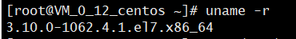

查看Linux的版本号：

>cat /etc/redhat-release

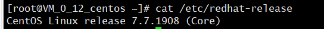

## Docker基础实验

### **1.Centos 7安装Docker**

- **更新应用程序数据库**

>sudo yum check-update

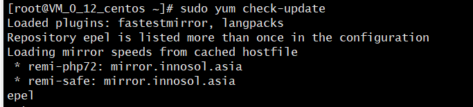

或者

>yum update -y

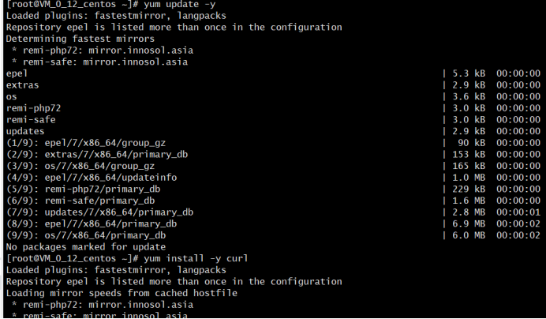

- **安装curl（不然执行下一步的时候回出现-bash: curl: command not found  的错误）**

>yum install -y curl

- **添加Docker官方仓库，安装最新Docker**

**以下命令作用是获取官方安装脚本（一键脚本自动安装）**

>curl -fsSL https://get.docker.com/ | sh

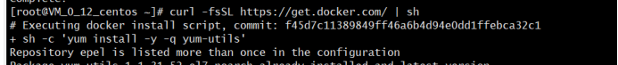

- **用systemctl命令启 Docker守护进 （Docker服 ）**

>systemctl start docker

- **验证Docker是否成功启动：**

>systemctl status docker

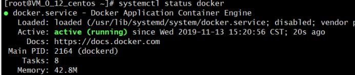

- **确保Docker当服务器启动时自启动：**

 >systemctl enable docker

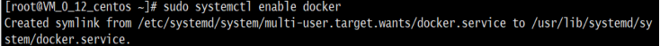

- **查看Docker的版本信息：**

 >docker version

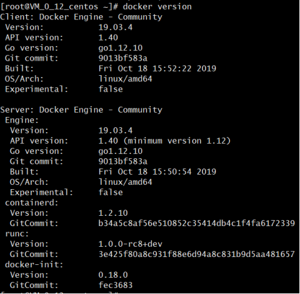

### **2.Docker获取CentOS镜像**

- **拉取 Centos 7**

>docker pull centos:7

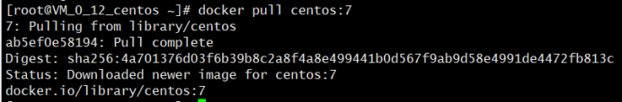

- **拉取完毕后查看镜像**

>docker images

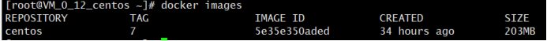

- **运行Docker容器**

**为了避免出现原先的wordpress被覆盖的问题，在运行Docker前需要做如下操作：**

- **下载安装initscripts**

>yum install  -y initscripts

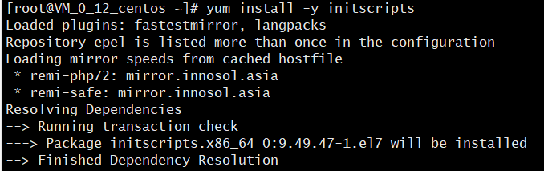

- **设置端口映射**

**为了方便检测后续wordpress搭建是否成功，需设置端口映射（-p），将容器端口80 映射到主机端口8888，如果不设置端口映射，原先的wordpress会被覆盖。**

**注意：**

**Apache和MySQL需要 systemctl 管理服务启动，需要加上参数 --privileged 来增权力；**

**并且不能使用默认的bash，换成 init，否则会提示 Failed to get D-Bus connection: Operation not permitted，-name 容器名 ，**

**命令如下**

>docker run -d -it --privileged --name wordpress -p 8888:80 -d centos:7 /usr/sbin/init

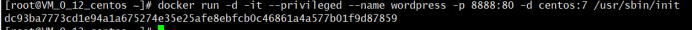

- **查看已启动的容器**

>docker ps

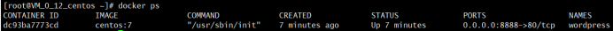

- **进入容器前台（容器i （CONTAINER ID）上一步中的第一行 可以只写前几位，如 ：dc ）**

>docker exec -it dc9 /bin/bash

### **3.容器中安装wordpress**

- **参照本人[CentOS上搭建WordPress个人网站教程](https://github.com/lyl10/cloud-computing/blob/master/Website/2.md)**

（该教程里访问公网IP都需加上端口 :8888)

- **安装完成后可通过浏览器访问 服务器IP:8888 查看**

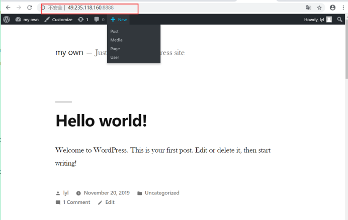

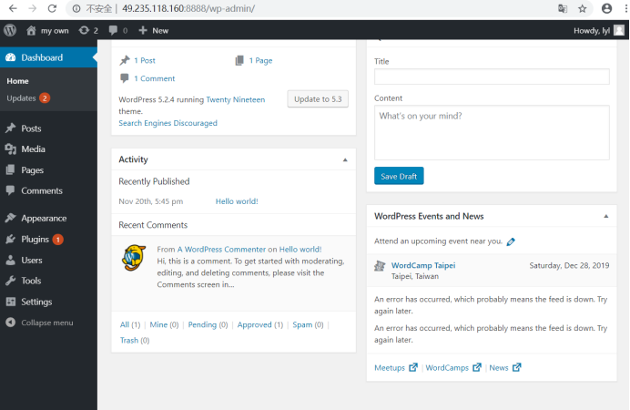

### **4.推送带有wordpress的镜像到远程镜像仓库**

- **首先前往Docker官方的镜像仓库[Docker hub](https://hub.docker.com/)注册账号。**
- **查看已启动的容器**

>docker ps -a

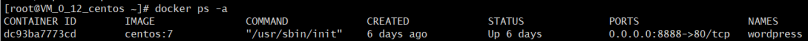

- **将更改后的容器，通过用commit命令来将容器生成镜 、即创建新的镜像**

(所生成的镜像名由 Docker用户名/Docker仓库名组成 ，否则推送会报错： denied: requested access to the resource is denied )

>docker commit -a Docker用户名 -m 提交描述 容器id 用户名:tag标签

例

>docker commit -a 1204630629 -m wordpress  installed  dc93ba7773cd  1204630629/centos:wordpress

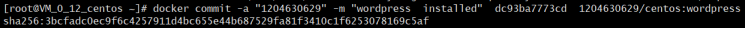

这种提交类似于git协议的提交，同样这里提交的镜像只保存在本地。后续可以提交到远程镜像仓库，比如Docker Hub。

- **再次使用镜像查看命令**

>docker images

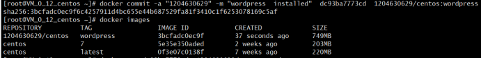

- **使用shell登录Docke 账号**

>docker login -u Docker用户名

输入密码即可

- **推送新创建的镜像**

>docker push 用户名:tag标签

 例

>docker push 1204630629/centos:wordpress

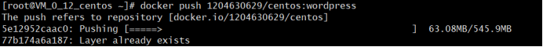

这将花费一定的时间，完成之后登陆Docker Hub，查看Repository，可以看到新上传的镜像。
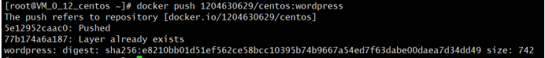

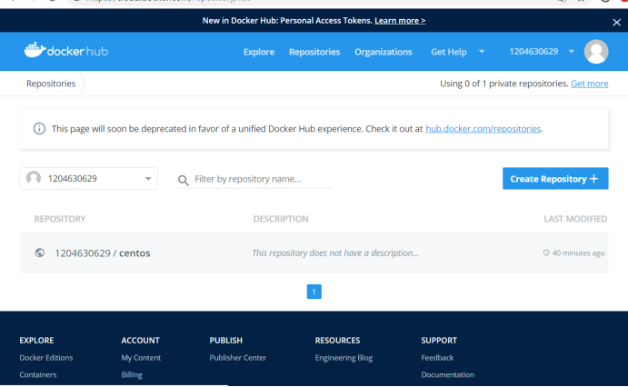

**相关资料**

**Docker的官方网站：**

**◼** [https://www.docker.com/](https://www.docker.com/)

**了解什么是Docker以及相关的概念和安装：**

**◼** [https://docs.docker.com/engine/docker-overview/](https://docs.docker.com/engine/docker-overview/)