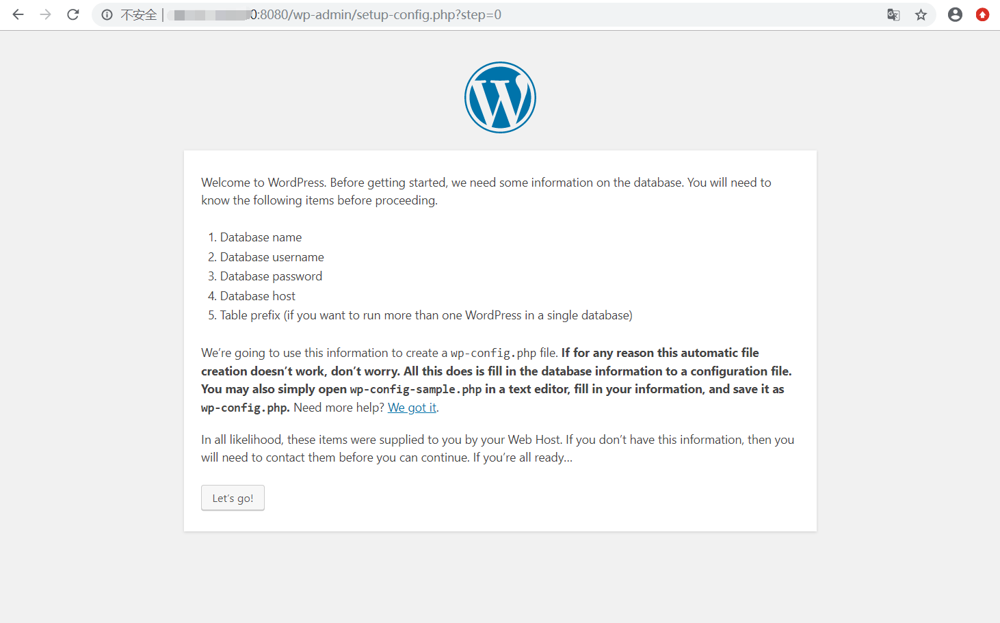
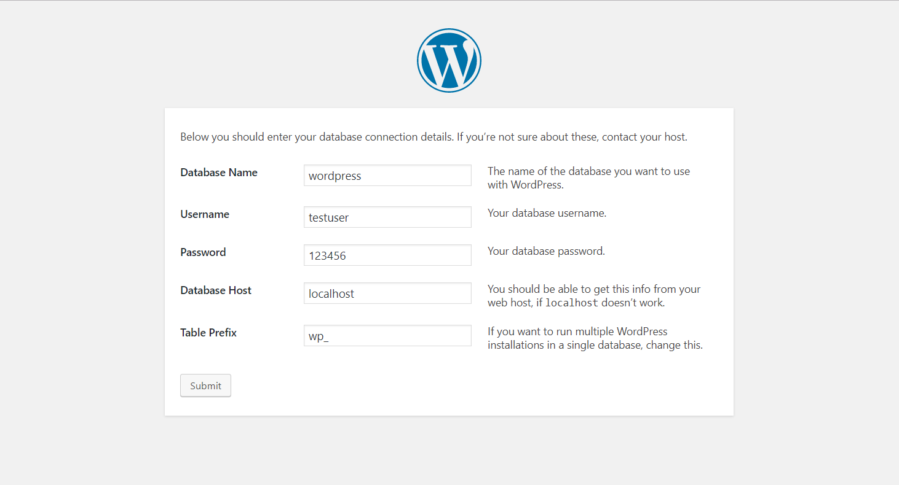

# **云计算实验三：利用Dockerfile文件创建包含WordPress的镜像**

## Dockerfile基本概念：

    镜像的定制实际上就是定制每一层所添加的配置、文件。如果我们可以把每一层修改、安装、构建、操作的命令都写入一个脚本，用这个脚本来构建、定制镜像，那么之前提及的无法重复的问题、镜像构建透明性的问题、体积的问题就都会解决。这个脚本就是 Dockerfile。

    Dockerfile 是一个文本文件，其内包含了一条条的 指令(Instruction)，每一条指令构建一层，因此每一条指令的内容，就是描述该层应当如何构建。


### 1.首先在当前目录下创建docker文件夹：

> mkdir docker


### 2.在当前文件夹下建立一个文本文件，并命名为 Dockerfile：然后编辑 Dockerfile 文件

> cd docker


> vim Dockerfile


Dockerfile文件内容如下：

 ``` 
#使用的基础镜像
FROM centos:latest

#添加作者信息
MAINTAINER Luyiling 1204630629@qq.com

#工作目录
WORKDIR /root/

#将file中的文件复制到 /root里
COPY f /root
#更新源
RUN yum  -y update 

#下载组件，给脚本添加可执行权限
RUN yum install -y wget initscripts tar\
    && chmod +x *.sh

#安装Apache Web服务器,mariadb数据库
RUN yum install -y mariadb-server mariadb httpd epel-release yum-utils


#启动MariaDB和Apache服务器
RUN  systemctl enable mariadb.service
RUN  systemctl enable httpd.service

#安装php以及php-mysql,因为WordPress需要php5.6以上版本的支持，我们更新到7.3版本仓库
RUN yum install -y epel-release yum-utils 
RUN yum install -y http://rpms.remirepo.net/enterprise/remi-release-8.rpm
RUN dnf module list php -y
RUN dnf module enable php:remi-7.3 -y
RUN yum install -y php php-mysql 
RUN yum -y install php-fpm php-gd  


#安装wordpress
# RUN wget http://wordpress.org/latest.tar.gz(最近还是访问不了官网，防火墙没法了,以下是github下载地址)
RUN wget https://raw.githubusercontent.com/helang0616/gitalk/master/wordpress-5.2.4.tar.gz
RUN tar zxf wordpress-5.2.4.tar.gz
RUN rm -rf /var/www/html
RUN mv wordpress /var/www/html

# 对Apache服务器的目录以及wordpress相关文件夹设置访问权限：
RUN chown -R apache:apache /var/www/html/*


#将start.sh添加到systemctl服务，并设置自启，以此初始化数据库
RUN mv start.service /usr/lib/systemd/system/\
  && chmod 754 /usr/lib/systemd/system/start.service\
  && systemctl enable start.service

#导出端口
EXPOSE 80

#启动容器时执行init，配合--privileged 可执行systemctl命令
CMD ["init"]

```


### 4.创建start.sh，start.service和db.sql

> vim start.sh

> vim start.service

> vim db.sql


start.sh文件如下：
 
```
#!/bin/sh
#数据库初始化脚本。
mysql < /root/db.sql
systemctl disable start.service
rm -rf /root/* /usr/lib/systemd/system/start.service
 ```


 start.sh 文件如下：

  ```
[Unit]
Description=start
After=mariadb.service


[Service]
Type=forking
ExecStart=/root/start.sh
PrivateTmp=true

[Install]
WantedBy=multi-user.target
 ```


 db.sql文件如下：

```
CREATE DATABASE wordpress ;
use wordpress ;
CREATE USER testuser@localhost IDENTIFIED BY '123456';
GRANT ALL PRIVILEGES ON wordpress.* TO testuser@localhost IDENTIFIED BY '123456';
FLUSH PRIVILEGES;
 ```


### 3.构建镜像

> docker build -t wordpresstest:v1 .  


### 4.创建并启动容器

> docker run -dit --privileged -p 8080:80 wordpresstest:v1   


### 5.查询启动的容器

> docker ps  


### 6.访问 IP:8080 查询结果





### 7.按mysql.sql配置一下：




成功了！